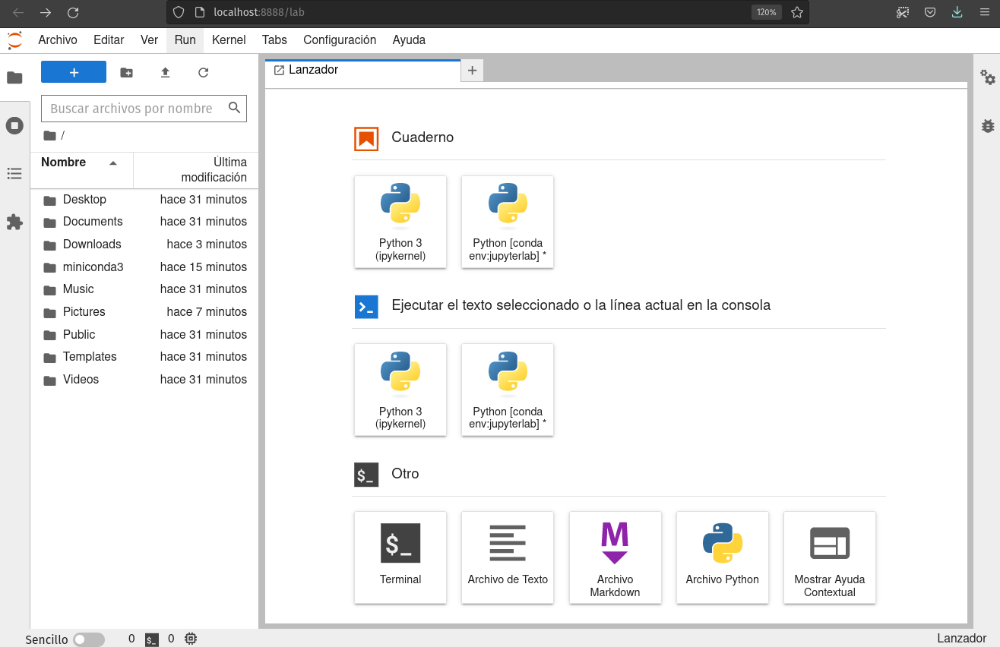

# Curso de introducción a Jupyter para principiantes

## ¿Qué es Jupyter?

[Jupyter](https://es.wikipedia.org/wiki/Proyecto_Jupyter) es un ecosistema abierto (*open source*) de computación desarrollado por el [Proyecto Jupyter](https://jupyter.org/) que incluye herramientas para el desarrollo, intercambio y presentación interactiva de código y proyectos de análisis de datos, con apoyo para una gran cantidad de lenguajes de programación (su nombre se deriva de los lenguajes de código abierto Julia, Python y R). 

El ecosistema del Proyecto Jupyter está [compuesto de tres elementos](https://jupyter4edu.github.io/jupyter-edu-book/why-we-use-jupyter-notebooks.html#but-first-what-is-jupyter-notebook): una colección de estándares, una comunidad y una serie de herramientas de software. [JupyterLab](https://jupyterlab.readthedocs.io/en/stable/) es una aplicación para crear, manejar y correr cuadernos (*notebooks*) Jupyter. Un [cuaderno Jupyter](https://jupyter-notebook.readthedocs.io/en/latest/) es un documento que permite mezclar código ejecutable, ecuaciones, visualizaciones y texto narrativo formateado. Un cuaderno puede combinar en un sólo documento el código, los datos que utiliza y sus resultados, incluyendo explicaciones, gráficas y contenido multimedia, de tal modo que pueda ser compartido ampliamente y corrido por otros con relativa facilidad. El cuaderno permite la creación de narrativas computacionales interactivas y reproducibles.

El ecosistema Jupyter utiliza tecnología web que permite correr las apliaciones en un navegador (*browser*) con las computaciones ya sea en tu propia computadora ("local") o a través de servicios o servidores remotos. Los cuadernos Jupyter y el ecosistema Jupyter hoy en día gozan de una gran popularidad en aplicaciones de ciencias de datos y aplicaciones científicas en general, especialmente con el lenguaje Python.

## JupyterLab: Instalación y lanzamiento

### Instalar JupyterLab

Instalaremos la aplicación `JupyterLab` en tu computadora, utilizando el sistema `conda`. Encontrarás instrucciones detalladas en [nuestra página de instalación de JupyterLab y conda.](instalacion-jlab-conda.md)

### Lanzar JupyterLab

La aplicación `JupyterLab` es lanzada desde la **terminal** (*shell*). En la terminal, primero cambia de carpeta hacia tu carpeta de inicio (*home folder*), o la carpeta que contiene los archivos que quieras utilizar. Luego activa el entorno "jupyterlab" recién creado (este ejemplo es en Windows):

```
cd C:\Users\MIPERFIL
conda activate jupyterlab
```

Ahora lanzamos la aplicación con este comando:

```bash
jupyter lab
```

`JupyterLab` se abrirá automáticamente en tu navegador de defecto. Si no es así, o si deseas utilizar un navegador diferente, abre este enlace local: http://localhost:8888/lab

## Interfaz de JupyterLab

### Cambiar el interfaz al español

El entorno que creamos permite cambiar el interfaz de JupyterLab al español. Para hacer este cambio, en el menú de `Settings` selecciona el submenú `Language`, y ahí selecciona Español:


Se abrirá una ventana de confirmación del cambio:


Al confirmarlo presionando `Change and reload`, el navegador se refrescará y verás el interfaz traducido al español.

### Tour del interfaz

Aunque JupyterLab tiene muchas características de un Entorno de Desarrollo Integrado (*IDE*) tradicional, su enfoque es en proveer una experiencia computacional interactiva y exploratoria.



El interfaz de JupyterLab consiste de un **área principal de trabajo** que contiene pestañas (*tabs*) de documentos y herramientas, una **barra lateral izquierda**, y una **barra de menú**. La barra lateral izquierda contiene el **navegador de archivos**, la lista de **núcleos (*kernels*), terminales y pestañas (*tabs*) activas**, la **tabla de contenido** para el documento activo, y el **administrador de extensiones**. En el área de trabajo pueden existir varios documentos o componentes abiertos en diferentes pestañas. Estos pueden incluir cuadernos, consolas de Python (similar a una terminal), terminales, y documentos de multimedia. El **lanzador** permite lanzar cuadernos nuevos (seleccionando el núcleo deseado), consolas, terminales, y otros tipos de archivos o herramientas. El menú `Ver > Activar paleta de comandos` da acceso a la **paleta de comandos**.

La documentación de JupyterLab contiene [más detalles sobre el interfaz](https://jupyterlab.readthedocs.io/en/stable/user/interface.html), en inglés.

## Cuadernos (*notebooks*) Jupyter


### Abre un Jupyter Notebook

Para una breve introducción a **Jupyter Notebooks**, consulta nuestra página [“Introducción a Jupyter Notebooks”](https://datacarpentry.org/python-ecology-lesson-es/jupyter_notebooks/index.html).


### otros apuntes de esta seccion

- terminal (o navegador Anaconda?). https://swcarpentry.github.io/shell-novice-es/ (y en Windows? Powershell?)


## Referencias

